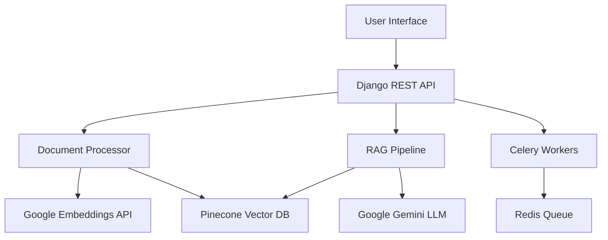

# 🧠 NeuraRAG - Advanced RAG Chatbot with Modern UI

[](https://python.org)
[](https://djangoproject.com)
[](https://ai.google.dev)
[](https://pinecone.io)
[](https://render.com)

> **🚀 Live Demo**: [https://neurarag.onrender.com](https://neurarag.onrender.com)

A sophisticated Retrieval-Augmented Generation (RAG) chatbot application built with Django, featuring a modern UI, intelligent document processing, and advanced query capabilities. NeuraRAG combines the power of Google's Gemini AI with Pinecone vector database for lightning-fast, context-aware responses.

## 📸 Screenshots


<!-- Add your screenshots here -->
*Coming soon - Add screenshots of your deployed application*

## ✨ Features

### 🎯 Core Functionality
- **📄 Multi-Format Document Support**: Upload PDF, DOCX, and TXT files
- **🧠 Intelligent Text Processing**: Advanced chunking with semantic overlap
- **🔍 Vector-Based Search**: Powered by Pinecone for lightning-fast similarity search
- **💬 Contextual Chat**: Google Gemini 2.5 Flash for human-like responses
- **📊 Real-time Processing**: Background document processing with Celery

### 🎨 Modern User Experience
- **🌟 Beautiful UI**: Modern, responsive design with gradient backgrounds
- **📱 Mobile-Friendly**: Fully responsive across all devices
- **⚡ Real-time Updates**: Live processing status and chat updates
- **🎭 Interactive Elements**: Smooth animations and transitions
- **🌙 Clean Interface**: Intuitive navigation and user-friendly design

### 🔧 Advanced Technical Features
- **☁️ Cloud-First Architecture**: Deployed on Render with free tier optimization
- **🔗 API-First Design**: RESTful APIs for all operations
- **📈 Scalable Vector Storage**: Pinecone integration for production workloads
- **🛡️ Robust Error Handling**: Production-ready error recovery and retry logic
- **🚀 Performance Optimized**: Memory-efficient processing for large documents

## 🏗️ Architecture



## 🚀 Quick Start

### 🌐 Try the Live Demo
Visit [https://neurarag.onrender.com](https://neurarag.onrender.com) to try NeuraRAG without any setup!

### 🛠️ Local Development

#### Prerequisites
- Python 3.9+
- Git
- Google AI API Key
- Pinecone API Key

#### 1. Clone the Repository
```bash
git clone https://github.com/yourusername/RAG_prototype.git
cd RAG_prototype
```

#### 2. Set Up Environment
```bash
# Create virtual environment
python -m venv venv
source venv/bin/activate  # On Windows: venv\Scripts\activate

# Install dependencies
pip install -r requirements.txt
```

#### 3. Configure Environment Variables
Create a `.env` file in the project root:
```env
# Django Configuration
DJANGO_SECRET_KEY=your-secret-key-here
DEBUG=True

# Google AI Configuration
GEMINI_API_KEY=your-google-ai-api-key

# Pinecone Configuration
USE_PINECONE=True
PINECONE_API_KEY=your-pinecone-api-key
PINECONE_INDEX_NAME=your-index-name

# Redis Configuration (for Celery)
REDIS_URL=redis://localhost:6379/0
```

#### 4. Set Up Database
```bash
cd RAG
python manage.py migrate
python manage.py collectstatic --noinput
```

#### 5. Start the Application
```bash
# Start Django server
python manage.py runserver

# In another terminal, start Celery worker (optional for async processing)
celery -A RAG worker --loglevel=info
```
