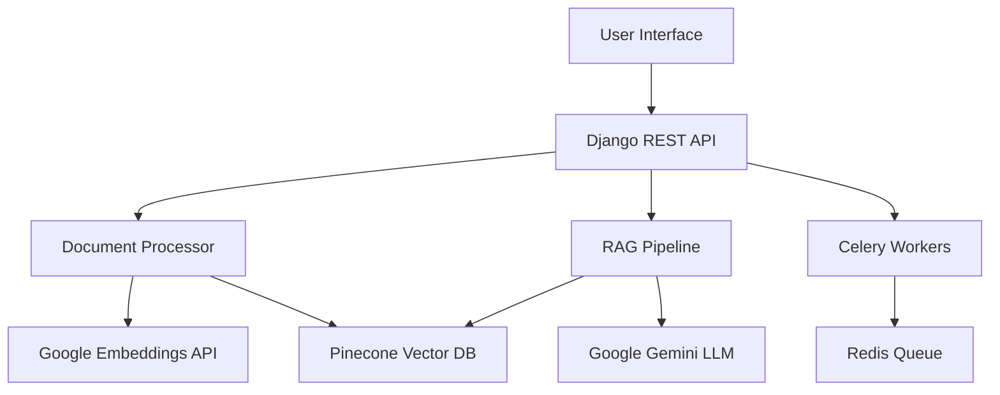

# 🧠 NeuraRAG - Advanced RAG Chatbot with Modern UI

[](https://python.org)
[](https://djangoproject.com)
[](https://ai.google.dev)
[](https://pinecone.io)
[](https://render.com)

> **🚀 Live Demo**: [https://neurarag.onrender.com](https://neurarag.onrender.com)

A sophisticated Retrieval-Augmented Generation (RAG) chatbot application built with Django, featuring a modern UI, intelligent document processing, and advanced query capabilities. NeuraRAG combines the power of Google's Gemini AI with Pinecone vector database for lightning-fast, context-aware responses.

## 📸 Screenshots

<!-- Add your screenshots here -->
*Coming soon - Add screenshots of your deployed application*

## ✨ Features

### 🎯 Core Functionality
- **📄 Multi-Format Document Support**: Upload PDF, DOCX, and TXT files
- **🧠 Intelligent Text Processing**: Advanced chunking with semantic overlap
- **🔍 Vector-Based Search**: Powered by Pinecone for lightning-fast similarity search
- **💬 Contextual Chat**: Google Gemini 2.5 Flash for human-like responses
- **📊 Real-time Processing**: Background document processing with Celery

### 🎨 Modern User Experience
- **🌟 Beautiful UI**: Modern, responsive design with gradient backgrounds
- **📱 Mobile-Friendly**: Fully responsive across all devices
- **⚡ Real-time Updates**: Live processing status and chat updates
- **🎭 Interactive Elements**: Smooth animations and transitions
- **🌙 Clean Interface**: Intuitive navigation and user-friendly design

### 🔧 Advanced Technical Features
- **☁️ Cloud-First Architecture**: Deployed on Render with free tier optimization
- **🔗 API-First Design**: RESTful APIs for all operations
- **📈 Scalable Vector Storage**: Pinecone integration for production workloads
- **🛡️ Robust Error Handling**: Production-ready error recovery and retry logic
- **🚀 Performance Optimized**: Memory-efficient processing for large documents

## 🏗️ Architecture



## 🚀 Quick Start

### 🌐 Try the Live Demo
Visit [https://neurarag.onrender.com](https://neurarag.onrender.com) to try NeuraRAG without any setup!

### 🛠️ Local Development

#### Prerequisites
- Python 3.9+
- Git
- Google AI API Key
- Pinecone API Key

#### 1. Clone the Repository
```bash
git clone https://github.com/yourusername/RAG_prototype.git
cd RAG_prototype
```

#### 2. Set Up Environment
```bash
# Create virtual environment
python -m venv venv
source venv/bin/activate  # On Windows: venv\Scripts\activate

# Install dependencies
pip install -r requirements.txt
```

#### 3. Configure Environment Variables
Create a `.env` file in the project root:
```env
# Django Configuration
DJANGO_SECRET_KEY=your-secret-key-here
DEBUG=True

# Google AI Configuration
GEMINI_API_KEY=your-google-ai-api-key

# Pinecone Configuration
USE_PINECONE=True
PINECONE_API_KEY=your-pinecone-api-key
PINECONE_INDEX_NAME=your-index-name

# Redis Configuration (for Celery)
REDIS_URL=redis://localhost:6379/0
```

#### 4. Set Up Database
```bash
cd RAG
python manage.py migrate
python manage.py collectstatic --noinput
```

#### 5. Start the Application
```bash
# Start Django server
python manage.py runserver

# In another terminal, start Celery worker (optional for async processing)
celery -A RAG worker --loglevel=info
```

## 📚 Usage Guide

### 📄 Document Upload
1. **Navigate to Documents**: Click on "Manage Documents" from the main page
2. **Upload File**: Click "Upload Document" and select your PDF, DOCX, or TXT file
3. **Wait for Processing**: The system will automatically chunk and embed your document
4. **Check Status**: Monitor processing progress in real-time

### 💬 Chat with Documents
1. **Go to Chat**: Click "Start Chatting" from the main page
2. **Ask Questions**: Type any question related to your uploaded documents
3. **Get Contextual Answers**: Receive AI-generated responses with source citations
4. **Continue Conversation**: Build on previous questions for deeper insights

### 🔧 Advanced Features
- **Multi-Document Search**: Ask questions across multiple uploaded documents
- **Source Citations**: Every answer includes references to source documents
- **Document Management**: View, delete, and reprocess documents as needed
- **Vector Store Management**: Clear and rebuild your knowledge base

## 🚀 Deployment on Render

This project is optimized for deployment on Render's free tier. Here's how to deploy your own instance:

### 1. Fork the Repository
Fork this repository to your GitHub account.

### 2. Create Render Services

#### Web Service
- **Repository**: Connect your forked repository
- **Build Command**: `./build.sh`
- **Start Command**: `gunicorn --bind 0.0.0.0:$PORT RAG.wsgi:application --workers 1 --worker-class sync --worker-connections 1000 --max-requests 1000 --timeout 120 --keep-alive 2 --preload`
- **Environment**: Python 3

#### Redis Service (Optional)
- Create a Redis instance for Celery background processing

### 3. Configure Environment Variables
Set the following environment variables in Render:
```
DJANGO_SECRET_KEY=your-secret-key
DEBUG=False
GEMINI_API_KEY=your-google-ai-key
PINECONE_API_KEY=your-pinecone-key
PINECONE_INDEX_NAME=your-index-name
USE_PINECONE=True
REDIS_URL=your-redis-url
```

### 4. Deploy
Your application will automatically deploy and be available at your Render URL!

### Web Interface

1. Open http://localhost:8000/
2. Upload documents using the upload area
3. Wait for processing to complete
4. Start asking questions about your documents

### API Usage

#### Upload a Document

```bash
curl -X POST http://localhost:8000/api/documents/ \
  -H "Content-Type: multipart/form-data" \
  -F "file=@document.pdf" \
  -F "title=My Document" \
  -F "file_type=pdf"
```

#### Ask a Question

```bash
curl -X POST http://localhost:8000/api/chat/ \
  -H "Content-Type: application/json" \
  -d '{"message": "What is this document about?"}'
```

## 🛠️ Tech Stack

### Backend
- **🐍 Django 4.2+**: Web framework and REST API
- **🔄 Django REST Framework**: API development
- **📊 Celery**: Asynchronous task processing
- **📚 SQLite**: Database (development) / PostgreSQL (production option)

### AI & ML
- **🤖 Google Gemini 2.5 Flash**: Large Language Model
- **🧠 Google Embeddings API**: Text embeddings generation
- **🔍 Pinecone**: Vector database for similarity search
- **📐 NumPy**: Numerical computations

### Frontend
- **🎨 Modern CSS**: Custom styling with gradients and animations
- **📱 Responsive Design**: Mobile-first approach
- **⚡ JavaScript**: Dynamic UI interactions
- **🎭 Font Awesome**: Icon library

### Infrastructure
- **☁️ Render**: Cloud deployment platform
- **📮 Redis**: Message broker for Celery
- **🔧 Gunicorn**: WSGI HTTP Server
- **📁 WhiteNoise**: Static file serving

## 📁 Project Structure

```
RAG_prototype/
├── RAG/                          # Django project root
│   ├── RAG/                      # Main Django app
│   │   ├── settings.py          # Configuration
│   │   ├── urls.py              # URL routing
│   │   └── wsgi.py              # WSGI application
│   └── assistant/               # Main application
│       ├── models.py            # Database models
│       ├── views.py             # API views
│       ├── rag_utils.py         # RAG pipeline
│       ├── document_utils.py    # Document processing
│       ├── tasks.py             # Celery tasks
│       └── templates/           # HTML templates
├── requirements.txt             # Python dependencies
├── build.sh                     # Render build script
├── render.yaml                  # Render configuration
└── README.md                    # This file
```

## 🤝 API Documentation

### Document Management
```http
GET /api/documents/                    # List all documents
POST /api/documents/                   # Upload new document
GET /api/documents/{id}/               # Get document details
DELETE /api/documents/{id}/            # Delete document
GET /api/documents/{id}/chunks/        # Get document chunks
```

### Chat Interface
```http
GET /api/chat-sessions/                # List chat sessions
POST /api/chat-sessions/               # Create new session
POST /api/chat-sessions/{id}/send_message/  # Send message
```

### Vector Database
```http
POST /api/rebuild-vector-db/           # Rebuild vector database
POST /api/clear-vector-db/             # Clear all vectors
```

## 🔒 Security Features

- **🛡️ CSRF Protection**: Built-in Django CSRF middleware
- **🔐 Environment Variables**: Sensitive data stored securely
- **🌐 CORS Configuration**: Proper cross-origin resource sharing
- **📝 Input Validation**: Comprehensive input sanitization
- **🔄 Rate Limiting**: API rate limiting for production use

## 🎯 Performance Optimizations

### Memory Efficiency
- **📊 Chunking Strategy**: Optimized text chunking for better memory usage
- **🔄 Batch Processing**: Efficient batch operations for large documents
- **🧹 Garbage Collection**: Automatic memory cleanup

### API Optimization
- **⏱️ Rate Limiting**: Respect API limits with intelligent backoff
- **🔄 Retry Logic**: Robust error handling with exponential backoff
- **📦 Caching**: Efficient caching strategies for embeddings

### Production Ready
- **🔧 Gunicorn Configuration**: Optimized for Render's free tier
- **📈 Monitoring**: Comprehensive logging and error tracking
- **🚀 Static Files**: Efficient static file serving with WhiteNoise

## Components

### Models
- **Document**: Stores uploaded documents
- **DocumentChunk**: Text chunks with embeddings
- **ChatSession**: User chat sessions
- **ChatMessage**: Individual messages
- **ProcessingTask**: Background processing status

### Core Classes
- **DocumentProcessor**: Handles text extraction and chunking
- **EmbeddingManager**: Generates embeddings using sentence-transformers
- **FAISSVectorStore**: Manages vector database operations
- **GeminiLLM**: Interfaces with Google Gemini API
- **RAGPipeline**: Orchestrates the entire RAG process

## File Processing

### Supported Formats
- **PDF**: Extracted using PyPDF2
- **DOCX**: Extracted using python-docx
- **TXT**: Direct text reading with encoding detection

### Text Processing Pipeline
1. Extract text from uploaded file
2. Clean and normalize text
3. Split into chunks with overlap
4. Generate embeddings for each chunk
5. Store in FAISS vector database
6. Index for fast retrieval

## Development

### Project Structure

```
RAG_prototype/
├── RAG/                    # Django project
│   ├── RAG/               # Project settings
│   ├── assistant/         # Main app
│   │   ├── models.py      # Database models
│   │   ├── views.py       # API views
│   │   ├── serializers.py # DRF serializers
## 🐛 Troubleshooting

### Common Issues

#### Document Processing Stuck
- **Problem**: Large documents timeout in production
- **Solution**: The app includes automatic retry logic and fallback processing

#### "String did not match" Error
- **Problem**: Special characters in documents cause API errors
- **Solution**: Enhanced text cleaning and validation

#### Pinecone Connection Issues
- **Problem**: Vector database connection fails
- **Solution**: Automatic fallback to local storage with proper error handling

### Getting Help
1. Check the [Issues](https://github.com/yourusername/RAG_prototype/issues) page
2. Review the application logs in Render dashboard
3. Verify all environment variables are set correctly

## 🔮 Future Enhancements

- [ ] **🎨 Advanced UI Themes**: Dark mode and custom themes
- [ ] **👥 User Authentication**: Multi-user support with document isolation
- [ ] **📊 Analytics Dashboard**: Usage statistics and performance metrics
- [ ] **🔄 Real-time Collaboration**: Shared document spaces
- [ ] **📱 Mobile App**: Native mobile applications
- [ ] **🌍 Multi-language Support**: International language support
- [ ] **🧠 Advanced AI Models**: Integration with latest AI models
- [ ] **📈 Scaling Options**: PostgreSQL and advanced caching

## 🤝 Contributing

We welcome contributions! Please see our [Contributing Guidelines](CONTRIBUTING.md) for details.

1. Fork the repository
2. Create a feature branch (`git checkout -b feature/amazing-feature`)
3. Commit your changes (`git commit -m 'Add amazing feature'`)
4. Push to the branch (`git push origin feature/amazing-feature`)
5. Open a Pull Request

## 📄 License

This project is licensed under the MIT License - see the [LICENSE](LICENSE) file for details.

## 🙏 Acknowledgments

- **Google AI**: For providing the Gemini API and Embeddings API
- **Pinecone**: For the excellent vector database service
- **Render**: For free-tier cloud hosting
- **Django Community**: For the amazing web framework
- **Open Source Community**: For all the incredible libraries used

## 📞 Contact & Support

- **🌐 Live Demo**: [https://neurarag.onrender.com](https://neurarag.onrender.com)
- **💻 GitHub**: [https://github.com/yourusername/RAG_prototype](https://github.com/yourusername/RAG_prototype)
- **📧 Email**: your.email@example.com
- **🐦 Twitter**: [@yourusername](https://twitter.com/yourusername)

---

<div align="center">

**⭐ Star this repository if you found it helpful! ⭐**

Made with ❤️ by [Your Name]

*Empowering conversations with AI-driven document intelligence*

</div>

CMD ["python", "manage.py", "runserver", "0.0.0.0:8000"]
```

## Troubleshooting

### Common Issues

1. **GEMINI_API_KEY not set**: Set your API key in the `.env` file
2. **Redis connection error**: Make sure Redis is running
3. **File upload fails**: Check file size limits and permissions
4. **Embeddings not working**: Ensure sentence-transformers model is downloaded

### Logs

- Django logs: Check console output
- Celery logs: Check Celery worker output
- Processing errors: Check Django admin → Processing Tasks

## Contributing

1. Fork the repository
2. Create a feature branch
3. Make your changes
4. Add tests
5. Submit a pull request

## License

This project is licensed under the MIT License.

## Future Enhancements

- [ ] Support for more document formats (Excel, PowerPoint)
- [ ] Multiple language support
- [ ] Integration with Slack/Teams
- [ ] Advanced search filters
- [ ] Document version control
- [ ] User permissions and sharing
- [ ] Analytics and usage tracking
- [ ] Custom embedding models
- [ ] Conversation memory and context
- [ ] Export chat history
